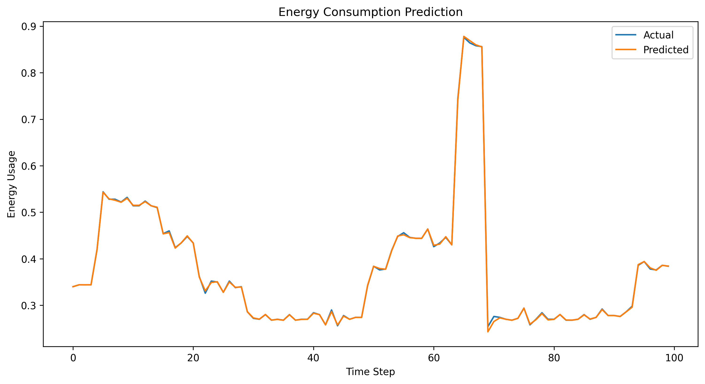
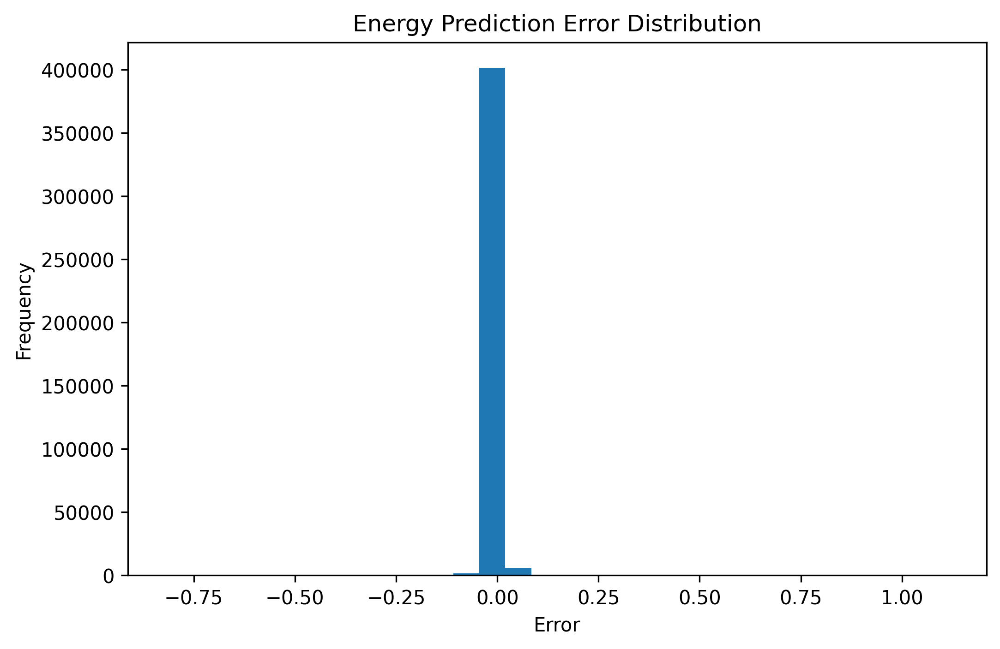

# AI Energy Consumption Prediction & Load Optimisation

## Overview
This project develops a machine learning-based system for short-term energy consumption prediction and load optimisation.

The system predicts future energy usage and translates those predictions into simple, actionable recommendations for energy management.

---

## Objectives
- Predict short-term energy consumption  
- Capture temporal patterns in energy usage  
- Evaluate model performance using regression metrics  
- Translate predictions into optimisation decisions  

---

## Methodology

### 1. Data Processing
- Loaded the household power consumption dataset  
- Identified missing values represented as `?`  
- Removed invalid entries and converted energy values to numeric format  
- Constructed a datetime column for time-series analysis  

### 2. Feature Engineering
- Extracted time-based features: hour, day, month  
- Created lag features from previous energy readings  
- Shifted the target variable forward to support future prediction  
- Excluded the rolling mean feature to reduce near-target leakage  

---

## Model
A Random Forest Regressor was used for prediction.

The model was trained on an 80/20 chronological split to preserve time-series order.

---

## Results

| Metric | Value |
|------|------|
| MAE | 0.0030 |
| RMSE | 0.0117 |
| R² | 0.9998 |

These results reflect the strong short-term temporal correlation in energy consumption data.

---

## Visualisations

### Prediction vs Actual


### Error Distribution


---

## Optimisation Layer

Predicted energy values were translated into practical recommendations:

- Low usage → normal  
- Moderate usage → monitor  
- High usage → reduce load  

The recommendation output was exported as:

`outputs/energy_recommendations.csv`

---

## Result Interpretation

The very high predictive performance reflects the fact that short-term energy usage changes gradually and remains strongly correlated with recent past values.

This makes the model particularly suitable for:
- real-time monitoring  
- short-term load optimisation  
- intelligent energy management systems  

---

## Repository Structure

```text
notebooks/
outputs/
README.md
.gitignore
```

---

## Dataset

UCI Individual Household Electric Power Consumption Dataset
Hebrail, G. & Berard, A. (2006). Individual Household Electric Power Consumption [Dataset].
UCI Machine Learning Repository. https://doi.org/10.24432/C58K54.

Note: The raw dataset is not included in this repository due to GitHub file size limits.

---

## Author

Nnamdi Onuigbo
AI Systems Engineer focused on building intelligent systems for automation, infrastructure, and real-world optimisation
